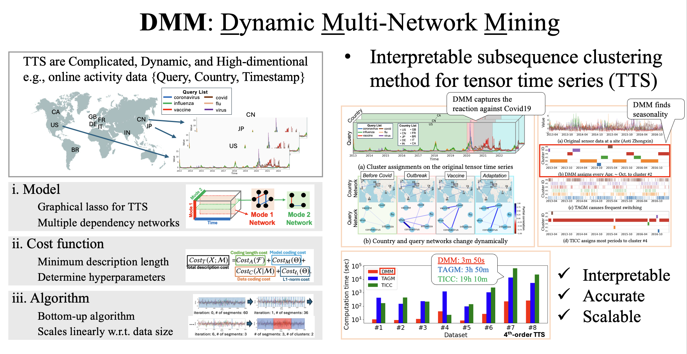

---
title:
layout: default
permalink: /research/dmm
published: true
---

## Interpretable subsequence clustering for tensor time series

### Reference

0. <u>Kohei Obata</u>, Koki Kawabata, Yasuko Matsubara, Yasushi Sakurai. “*Dynamic Multi-Network Mining of Tensor Time Series*”. Proceedings of the ACM Web Conference 2024 (WWW ’24), May 13--17, 2024, Singapore. (doi: [10.1145/3589334.3645461](https://doi.org/10.1145/3589334.3645461), [github](https://github.com/KoheiObata/DMM))