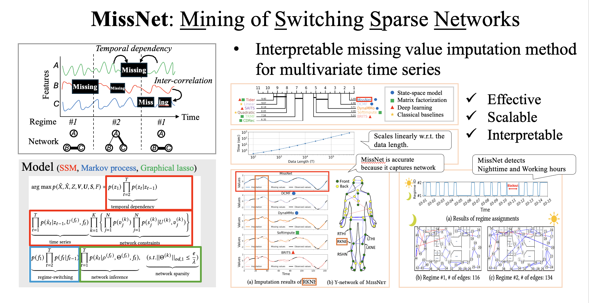

---
title:
layout: default
permalink: /research/missnet
published: true
---

## Missing value imputation leveraging network inference

### Reference

0. <u>Kohei Obata</u>, Koki Kawabata, Yasuko Matsubara, Yasushi Sakurai. “*Mining of Switching Sparse Networks for Missing Value Imputation in Multivariate Time Series*”. Proceedings of the 30th ACM SIGKDD Conference on Knowledge Discovery and Data Mining (KDD ’24), August 25--29, 2024, Barcelona, Spain. (doi: [10.1145/3637528.3671760](https://doi.org/10.1145/3637528.3671760), [github](https://github.com/KoheiObata/MissNet))