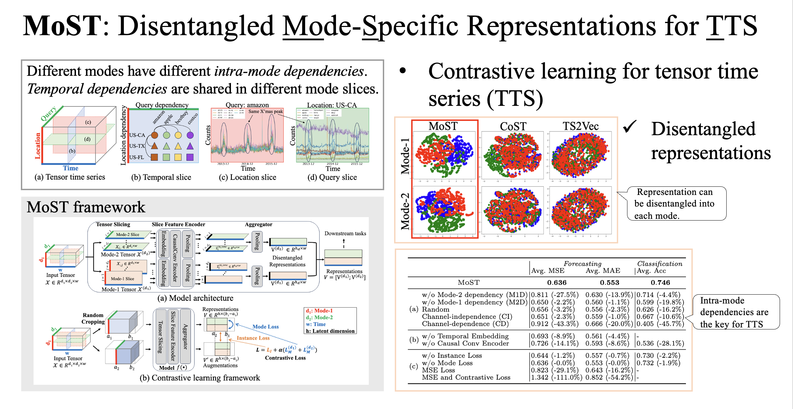

---
title:
layout: default
permalink: /research/most
published: true
---

## Contrastive learning for tensor time series

### Reference

0. <u>Kohei Obata</u>, Taichi Murayama, Zheng Chen, Yasuko Matsubara, Yasushi Sakurai. “*Disentangled Mode-Specific Representations for Tensor Time Series via Contrastive Learning*”. PAKDD'25. (doi: [TBA](), [github](https://github.com/KoheiObata/MoST))