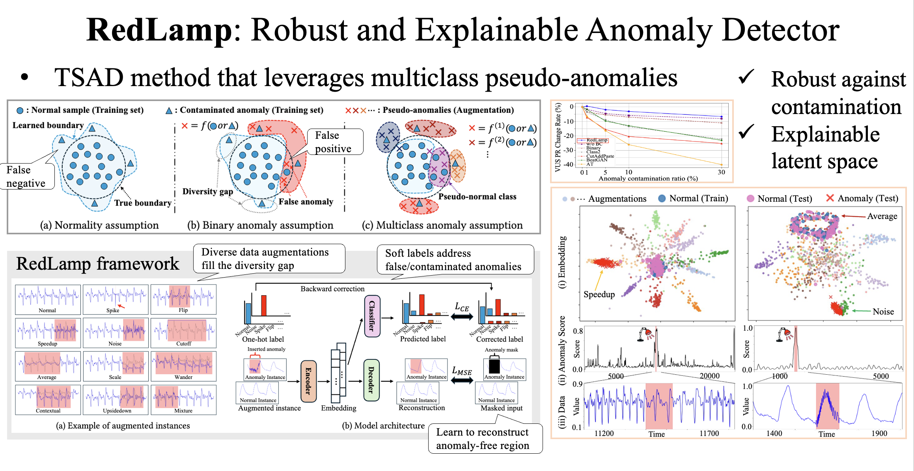

---
title:
layout: default
permalink: /research/redlamp
published: true
---

## Data augmentation for time series anomaly detection

### Reference

0. <u>Kohei Obata</u>, Yasuko Matsubara, Yasushi Sakurai. “*Robust and Explainable Detector of Time Series Anomaly via Augmenting Multiclass Pseudo-Anomalies*”. Proceedings of the 31th ACM SIGKDD Conference on Knowledge Discovery and Data Mining (KDD ’25), August 3--7, 2025, Toronto, Canada. (doi: [TBA](), [github](https://github.com/KoheiObata/RedLamp), [supplement](https://github.com/KoheiObata/time-series-pseudo-anomaly))